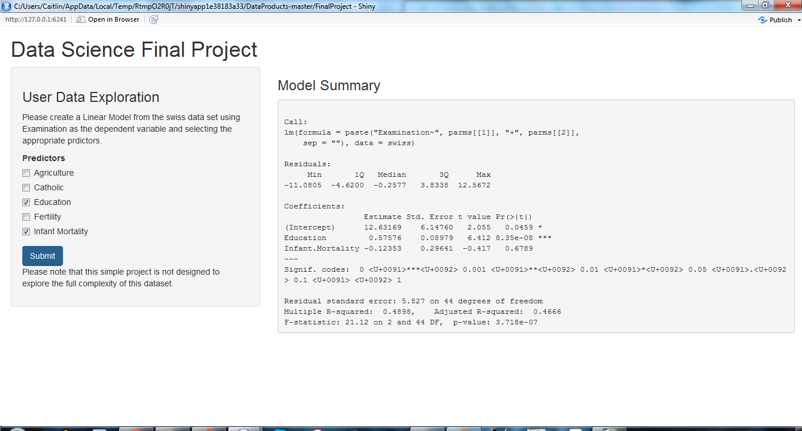

AppPitch
========================================================
author: Caitlin Hart
date: June 21, 2015
width: 1280
height: 1020

Application Summary
========================================================

This app allows users to select the predictors to a linear model using the **swiss** 
data set and *Examination* as the dependent variable.

The users select the predictors with checkboxes and are presented with the summary 
of resulting model. They can then re-select predictors to improve the model.

Data Summary
========================================================


```r
str(swiss)
```

```
'data.frame':	47 obs. of  6 variables:
 $ Fertility       : num  80.2 83.1 92.5 85.8 76.9 76.1 83.8 92.4 82.4 82.9 ...
 $ Agriculture     : num  17 45.1 39.7 36.5 43.5 35.3 70.2 67.8 53.3 45.2 ...
 $ Examination     : int  15 6 5 12 17 9 16 14 12 16 ...
 $ Education       : int  12 9 5 7 15 7 7 8 7 13 ...
 $ Catholic        : num  9.96 84.84 93.4 33.77 5.16 ...
 $ Infant.Mortality: num  22.2 22.2 20.2 20.3 20.6 26.6 23.6 24.9 21 24.4 ...
```

Screenshot
========================================================


Example Output
========================================================
This is what the user will see after they select paramters *Education* and *Infant Mortality* and click the "Submit" button.

```r
model2 <- lm(Examination~Education+Infant.Mortality,data=swiss)
summary(model2)
```

```

Call:
lm(formula = Examination ~ Education + Infant.Mortality, data = swiss)

Residuals:
     Min       1Q   Median       3Q      Max 
-11.0805  -4.6200  -0.2577   3.8338  12.5672 

Coefficients:
                 Estimate Std. Error t value Pr(>|t|)    
(Intercept)      12.63169    6.14760   2.055   0.0459 *  
Education         0.57576    0.08979   6.412 8.35e-08 ***
Infant.Mortality -0.12353    0.29641  -0.417   0.6789    
---
Signif. codes:  0 '***' 0.001 '**' 0.01 '*' 0.05 '.' 0.1 ' ' 1

Residual standard error: 5.827 on 44 degrees of freedom
Multiple R-squared:  0.4898,	Adjusted R-squared:  0.4666 
F-statistic: 21.12 on 2 and 44 DF,  p-value: 3.718e-07
```
